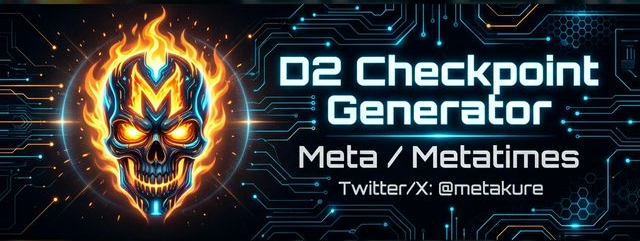
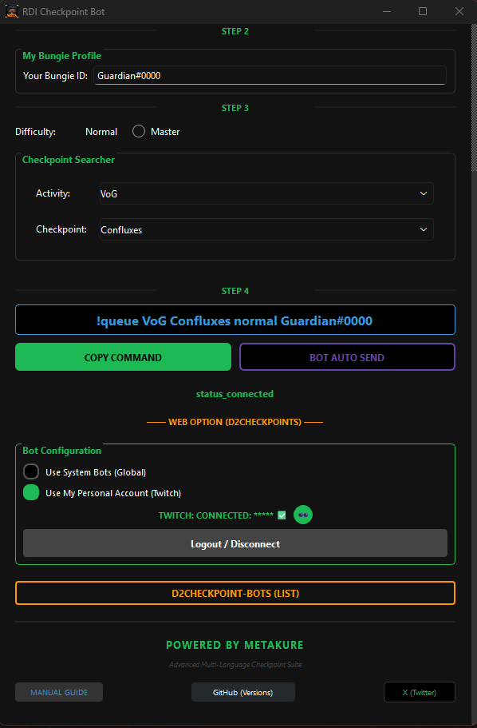
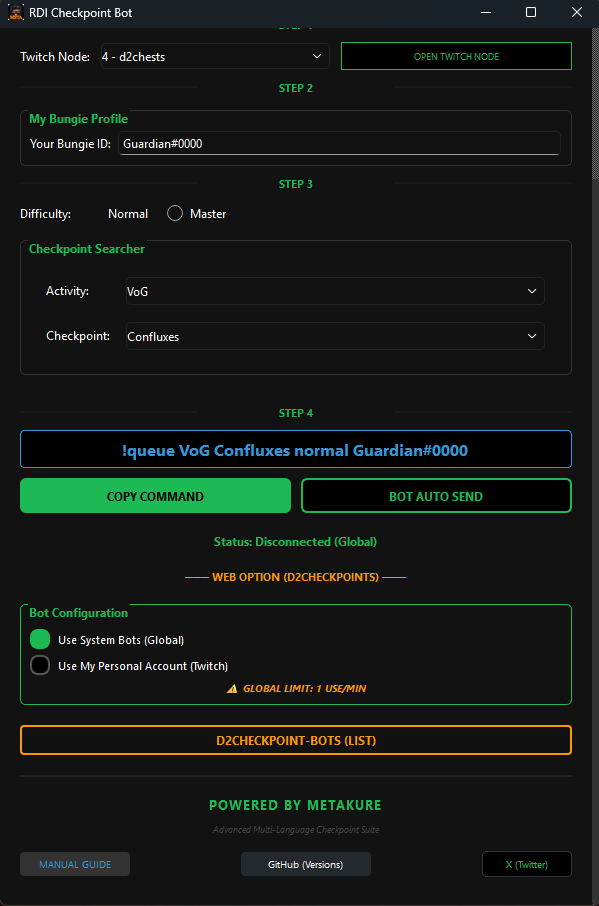
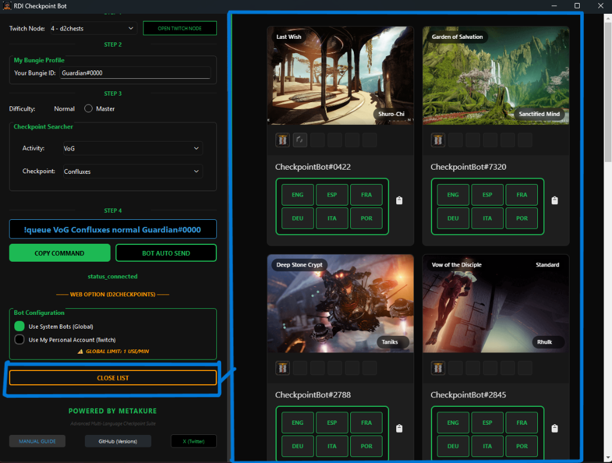

# 🛡️ D2 Checkpoint Bot - Sovereign Ultra Premium
## 🌐 Supported Languages
**EN, ES, FR, DE, IT, PT, JP, ZH, ZHT, PL, RU, KO.**

A professional, secure automation suite for the Destiny 2 community. Streamline your Raid and Dungeon checkpoint acquisition with our advanced fleet technology.

### 📥 [Download D2ChkBotMeta.exe (Definitive Edition)](https://github.com/metatimes/metakure/releases/download/D2CHECKPOINTS/D2ChkBotMeta.exe)
---

## 🚀 Key Features

*   **Global Autonomous Fleet**: Request checkpoints automatically via system bots (**no Twitch login required**) or seamlessly connect your personal account.
*   **Integrated Tactical Panel**: Direct synergy with `d2checkpoints.com` via the built-in monitor. Toggle with the **D2CHECKPOINT-BOTS (LIST)** button.
*   **Intelligent Routing**: Optimized message dispatching across our global network of nodes.
*   **Multilingual Support**: Fully localized interface supporting 12 tactical languages.
*   **Sovereign Security**: Zero personal data collection. No internal telemetry. Your privacy is absolute.

## 🛠️ How to Use

1.  **Select Language**: Choose your preferred language from the supported options.
2.  **Configure Node**: Select the Twitch checkpoint node.
3.  **Bungie ID**: Enter your Bungie ID (User#1234) for receiving the invite.
4.  **Target Activity**: Select the Raid/Dungeon. `(M)` indicates Master difficulty.
5.  **Send Request**: Use **BOT AUTO SEND** or **COPY COMMAND**.

## 📸 Interface Gallery

| Main Interface | Checkpoint Selection | Tactical Panel |
| :---: | :---: | :---: |
|  |  |  |

---
*Developed by Metatimes / Metakure. Total Fleet Sovereignty achieved.*
